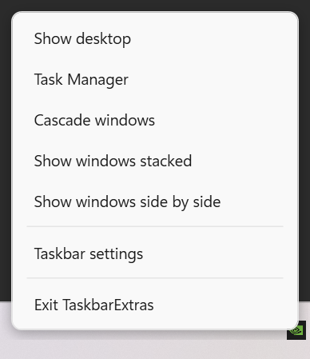
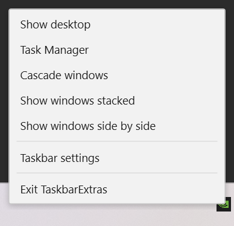

# TaskbarExtras

**English** · [简体中文](README.md)

Windows 11 threw away most of the taskbar right-click menu. This puts it back.



## How this started

Left hand holding a drink, right hand just off the keyboard, and I wanted the desktop.

`Win+D` needs a hand I didn't have. So I did the obvious thing and right-clicked the taskbar for **Show desktop**.

It's gone. Windows 11 removed it.

Microsoft, what are you doing 😡

Fine. I'll do it myself. ε=( o｀ω′)ノ

## What you get

Right-click the taskbar's empty background:

| | |
|---|---|
| Show desktop | Minimise everything; click again to restore |
| Task Manager | |
| Cascade windows | |
| Show windows stacked | |
| Show windows side by side | |
| Taskbar settings | |
| Exit TaskbarExtras | |

Only the **empty** part of the taskbar is intercepted. Right-clicking Start still gives you Win+X, right-clicking a task button still gives you its jump list, right-clicking a tray icon still gives you its own menu. None of that is touched.

## Running it

Grab it from [Releases](../../releases), or build it:

```bash
dotnet publish src/TaskbarExtras.App -c Release -r win-x64 --self-contained true \
  -p:PublishSingleFile=true -p:IncludeNativeLibrariesForSelfExtract=true \
  -p:EnableCompressionInSingleFile=true -o publish
```

One exe comes out. Double-click it. No admin rights, no .NET install needed.

```
TaskbarExtras.exe                     start
TaskbarExtras.exe --quit              ask a running instance to stop
TaskbarExtras.exe --lang zh|en        force the UI language (defaults to your system)
TaskbarExtras.exe --skin win11|win10  menu appearance (defaults to win11)
TaskbarExtras.exe --preview           show the menu once, for trying out a skin
TaskbarExtras.exe --help              print this
```

## Quitting

There's no main window, so there's nothing to close. Three ways out:

1. Right-click the taskbar → **Exit TaskbarExtras** (last row of the menu)
2. Right-click the tray icon → Exit. It lives in the `^` overflow flyout — a dark square with three bars.
3. `TaskbarExtras.exe --quit`

## Skins

Everything the menu looks like lives in a `ResourceDictionary`. A new skin is a new xaml file, no C# changes.

| win11 (default) | win10 |
|---|---|
|  |  |

```bash
TaskbarExtras.exe --preview --skin win10
```

## Two rules

**Nothing gets injected.** No DLL into `explorer.exe`, no patching, no touching system files. It's an ordinary process. Close it and nothing is left behind.

**Documented APIs only.** The right-click is intercepted with `WH_MOUSE_LL`, in our own process. Window arrangement goes through `IShellDispatch`. The taskbar geometry comes from `SHAppBarMessage` and `GetMonitorInfo`. No private struct offsets, no byte signatures.

The reason is practical: tools built on injection have to be rewritten every time Windows updates, and when they fall behind they break. The measurements and the reasoning are in [docs/DESIGN.md](docs/DESIGN.md).

## Next

- [ ] Animate the menu (fade in, slide out)
- [ ] More skins
- [ ] A Windows 10 style Start menu
- [ ] Live tiles
- [ ] A Windows 10 style taskbar and tray

## Known issues

- Only tested on a single 150%-scaled display. Dual monitors and mixed DPI are unverified.
- About 40 ms between the right-click and the menu appearing — swallowing the click and then rendering can't be made free.
- No config file. Skin and language are command-line only.
- No compatibility handling for other taskbar tools; running them side by side may fight.

## Licence

MIT.
