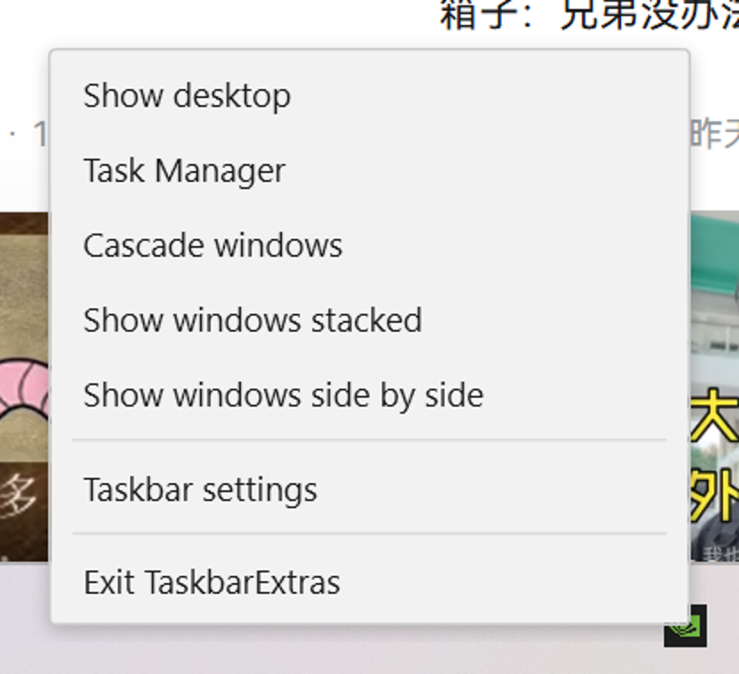

# TaskbarExtras

**English** · [简体中文](README.zh-CN.md)

Windows 11 threw away most of the taskbar right-click menu. This puts it back.


---

## How this started

Left hand holding a drink, right hand just off the keyboard, and I wanted the desktop.

`Win+D` needs a hand I didn't have. So I did the obvious thing and right-clicked the taskbar for **Show desktop**.

It isn't there any more. Windows 11 removed it.

Fine. I'll do it myself.

---

## What you get

Right-click the taskbar's empty background:

| Entry | What it does |
|---|---|
| Show desktop | Minimise everything; click again to restore |
| Task Manager | Open Task Manager |
| Cascade windows | Stack all windows diagonally |
| Show windows stacked | Tile them top and bottom |
| Show windows side by side | Tile them left and right |
| Taskbar settings | Open the taskbar page in Settings |
| Exit TaskbarExtras | Quit |

Only the **empty** part of the taskbar is intercepted. Right-clicking Start still gives you `Win+X`, right-clicking a task button still gives you its jump list, right-clicking a tray icon still gives you its own menu. None of that is touched.

---

## Running it

Grab it from [Releases](../../releases), or build it:

```bash
dotnet publish src/TaskbarExtras.App -c Release -r win-x64 --self-contained true \
  -p:PublishSingleFile=true -p:IncludeNativeLibrariesForSelfExtract=true \
  -p:EnableCompressionInSingleFile=true -o publish
```

One self-contained exe comes out. Double-click it. **No admin rights**, no .NET install needed.

```
TaskbarExtras.exe                     start
TaskbarExtras.exe --quit              ask a running instance to stop
TaskbarExtras.exe --lang zh|en        force the UI language (defaults to your system)
TaskbarExtras.exe --skin win11|win10  menu appearance (defaults to win11)
TaskbarExtras.exe --preview           show the menu once, for trying out a skin
TaskbarExtras.exe --help              print this
```

## Quitting

There's no main window, so there's nothing to close. Three ways out:

1. Right-click the taskbar → **Exit TaskbarExtras** (last row of the menu)
2. Right-click the tray icon → Exit. It lives in the `^` overflow flyout — a dark square with three bars.
3. `TaskbarExtras.exe --quit`

---

## Skins

Everything the menu looks like lives in a `ResourceDictionary`. A new skin is a new xaml file; no C# changes.

| win11 (default) | win10 |
|---|---|
|  |  |
| Rounded, roomy, soft shadow — sits next to the system's own menus without looking out of place | Square, tight, flat — pick this if you want the old feel |

```bash
TaskbarExtras.exe --preview --skin win10    # look before you commit
```

---

## Two rules I held myself to

**One: nothing gets injected.** No DLL into `explorer.exe`, no patching, no touching system files. It's an ordinary process. Start it and it sits in the background; close it and nothing is left behind.

**Two: documented APIs only.** The right-click is intercepted with `WH_MOUSE_LL`, in our own process. Window arrangement goes through `IShellDispatch`. The taskbar geometry comes from `SHAppBarMessage` and `GetMonitorInfo`. Nothing here depends on a private struct offset or a byte signature.

Why care? Because tools built on injection have to be rewritten every time Windows ships a feature update, and when they fall behind they don't degrade — they break the shell. That's a much worse failure mode than a missing menu entry.

This isn't a slogan. The menu was prototyped in Python + ctypes through four rounds of spikes, and only then written in C#. The measurements and the reasoning are in [`docs/DESIGN.md`](docs/DESIGN.md) — including the parts I got wrong and had to reverse.

---

## Known issues

- **Only tested on a single 150%-scaled display.** Dual monitors and mixed DPI are handled in theory but unverified, and unverified means unverified.
- **About 40 ms of latency** between the right-click and the menu appearing. Swallowing the click and then rendering can't be made free.
- No config file. Skin and language are command-line only.
- No compatibility handling for other taskbar tools; running them side by side may fight.

## Licence

MIT.
