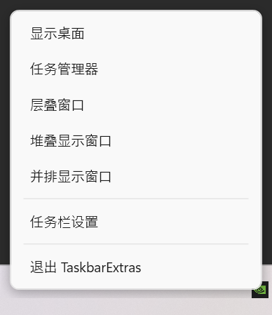
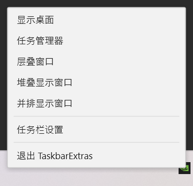

# TaskbarExtras

[English](README.en.md) · **简体中文**

把 Windows 11 删掉的任务栏右键菜单补回来。



## 起因

那天我左手端着快乐水，右手刚离开键盘，想回桌面开个东西。

按 `Win+D` 得腾出手，我没有。于是很自然地右键任务栏，准备点「显示桌面」。

结果这个选项没了。

微软你在干什么啊 😡

行，我自己加回来。 ε=( o｀ω′)ノ

## 能干嘛

右键任务栏的空白处：

| | |
|---|---|
| 显示桌面 | 最小化所有窗口，再点一次还原 |
| 任务管理器 | |
| 层叠窗口 | |
| 堆叠显示窗口 | |
| 并排显示窗口 | |
| 任务栏设置 | |
| 退出 TaskbarExtras | |

只有任务栏**空白处**会被拦截。右键开始按钮还是 Win+X，右键任务图标还是跳转列表，右键托盘图标还是各自的菜单 —— 这些都没动。

## 跑起来

去 [Releases](../../releases) 下载，或者自己编：

```bash
dotnet publish src/TaskbarExtras.App -c Release -r win-x64 --self-contained true \
  -p:PublishSingleFile=true -p:IncludeNativeLibrariesForSelfExtract=true \
  -p:EnableCompressionInSingleFile=true -o publish
```

出来一个 exe，双击就行。不用管理员权限，也不用预先装 .NET。

```
TaskbarExtras.exe                     启动
TaskbarExtras.exe --quit              让正在运行的实例退出
TaskbarExtras.exe --lang zh|en        强制界面语言（默认跟随系统）
TaskbarExtras.exe --skin win11|win10  菜单外观（默认 win11）
TaskbarExtras.exe --preview           只显示一次菜单，用来预览皮肤
TaskbarExtras.exe --help              显示说明
```

## 怎么退出

没有主窗口，所以没东西可以关。三条路：

1. 右键任务栏 → 菜单最后一项「退出 TaskbarExtras」
2. 右键托盘图标 → 退出（图标在 `^` 折叠区里，深色方块加三道横杠）
3. `TaskbarExtras.exe --quit`

## 皮肤

菜单外观全写在 `ResourceDictionary` 里。加一套皮肤就是加一个 xaml，不用改 C#。

| win11（默认） | win10 |
|---|---|
|  |  |

```bash
TaskbarExtras.exe --preview --skin win10
```

## 两条原则

**不注入任何进程。** 不往 `explorer.exe` 里塞 DLL，不打补丁，不改系统文件。它就是个普通进程，关了什么都不留。

**只用文档化 API。** 拦截右键用 `WH_MOUSE_LL`（跑在自己进程里），窗口排布用 `IShellDispatch`，任务栏位置用 `SHAppBarMessage` 和 `GetMonitorInfo`。没有私有结构体偏移，也没有特征码扫描。

原因很实际：靠注入实现的工具，每次 Windows 更新都得跟着改，没跟上就整个坏掉。实测数据和推演过程在 [docs/DESIGN.md](docs/DESIGN.md)。

## 下一步

- [ ] 菜单加动画（淡入、滑出）
- [ ] 做更多样式
- [ ] Windows 10 风格的开始菜单
- [ ] 恢复磁贴
- [ ] 恢复 Windows 10 风格的任务栏和托盘

## 已知问题

- 只在单屏 150% 缩放上测过。双屏和混合 DPI 没验证。
- 右键到菜单出来有约 40ms 延迟 —— 鼠标钩子拦下右键再渲染，这个开销消不掉。
- 没有配置文件，皮肤和语言只能靠命令行参数。
- 没做和其他任务栏工具的兼容，一起装可能打架。

## 许可

MIT。
