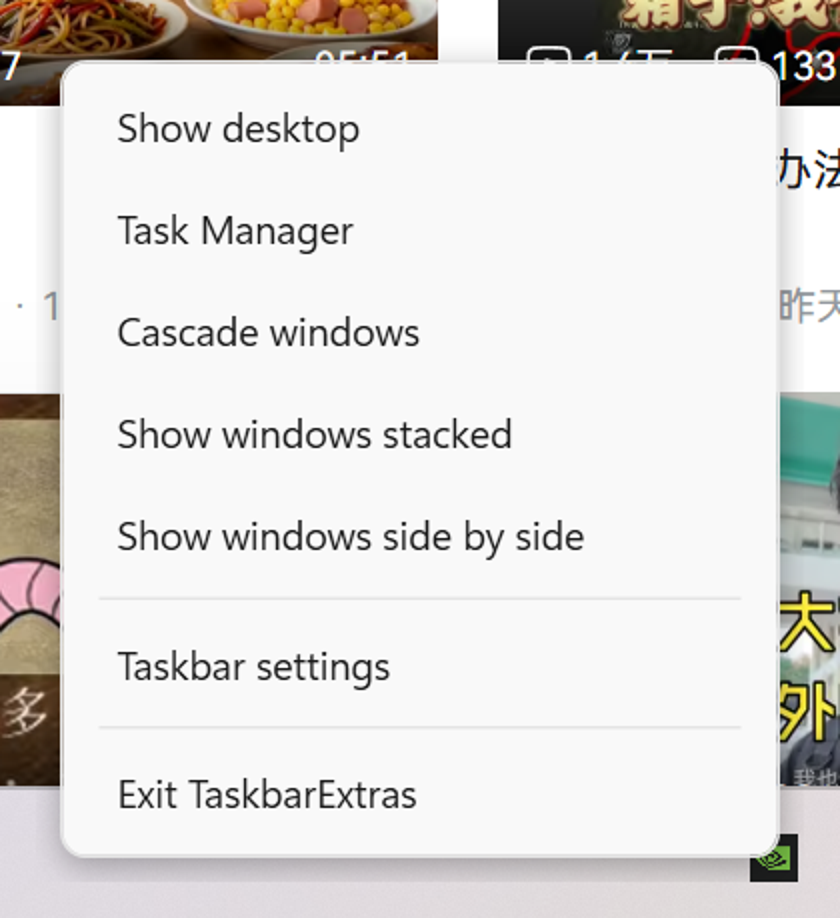

# TaskbarExtras

**English** · [简体中文](README.zh-CN.md)

**Windows 11 cut the taskbar right-click menu down to two entries. This brings it back — without injecting a single byte into `explorer.exe`.**

On Windows 10, right-clicking the taskbar gave you: *Toolbars · Cascade windows · Show windows stacked · Show windows side by side · Show desktop · Task Manager · Lock the taskbar · Taskbar settings.*

On Windows 11 you get *Task Manager* and *Taskbar settings*. That's it.



Right-click the taskbar's empty background and this appears instead — in about **40 ms**, with the shell's own menu never appearing at all.

---

## Why not just use StartAllBack or ExplorerPatcher?

Fair question — both already exist and both work. The difference is *how* they work, and that difference has a measurable cost.

### They inject. This doesn't.

| | Approach | Load vector |
|---|---|---|
| **ExplorerPatcher** | DLL search-order hijacking | Renames its main DLL to `dxgi.dll` and drops it in `C:\Windows`, `StartMenuExperienceHost_*\`, and `ShellExperienceHost_*\` so Windows loads it before the real `System32` copy |
| **StartAllBack** | Undisclosed | Not registered in any user-readable location. `AppInit_DLLs`, `AppCertDlls`, `C:\Windows` proxy-DLL hijacking, `ShellServiceObjects`, `ShellExecuteHooks`, `Winlogon\Notify`, `HKLM\SOFTWARE\Classes\CLSID` (all 7836 keys scanned), `HKCU\SOFTWARE\Classes`, `Shell Extensions\Approved`, `shellex\ContextMenuHandlers`, Run keys and same-named services are **all clean**. The only remaining candidate is a scheduled task, which needs admin rights to enumerate |
| **TaskbarExtras** | **Nothing is injected** | No DLL, no hook into another process, no elevation. It creates its own window and installs a mouse hook **in its own process** |

### The cost of injecting is real, and I measured it

ExplorerPatcher ships a **separate taskbar implementation per Windows build** — `ep_taskbar.0.dll` for the Windows 10 taskbar, `.1` for 21H2, `.2` for 22H2, `.3` for Dev, `.4`/`.5` for Canary. When Microsoft removes the code those modules depend on, they break.

That is not hypothetical. In this very project, StartAllBack **3.9.16** — eleven versions behind, released October 2025 — silently stopped working the moment the machine moved to Windows 11 **26H2 (build 26300.9457)**, a build that did not exist when it shipped. Its config key `HKCU\SOFTWARE\StartIsBack` was sitting at `Disabled = 1` while its DLL was still resident in `explorer.exe`.

A tool that injects inherits a permanent maintenance burden: every Windows feature update is a potential break, and the failure mode is a broken shell rather than a degraded feature.

This project takes the opposite bet. Everything it calls is documented:

- `WH_MOUSE_LL` — the mouse hook API (`SetWindowsHookEx`), running in our own process
- `IShellDispatch` — the shell's own window-arrangement verbs
- `SHAppBarMessage` — the appbar protocol (implemented, currently opt-in)
- `EnumWindows`, `GetMonitorInfo`, `DwmGetWindowAttribute` — plain window management

Nothing depends on a private struct layout or an RVA signature.

---

## How it works

### 1. Intercepting the right-click — and the two attempts that failed first

This is the interesting part, because the obvious approaches don't work.

**Attempt 1 — `EVENT_SYSTEM_MENUPOPUPSTART`.** "A menu is about to pop up" sounds exactly right. It fires **zero times** for the Windows 11 taskbar menu, because that menu is not a classic Win32 `#32768` menu — it is a XAML popup. The whole `EVENT_SYSTEM_MENU*` family is blind to it.

I only trusted that negative result after a control experiment:

| Phase | Action | Result |
|---|---|---|
| **Control** | `Alt+Space` → window system menu (a real classic menu) | `#32768` window appears **and `EVENT_SYSTEM_MENUSTART` fires** → the hook itself works |
| **Test** | Right-click on empty taskbar | Menu **does** open, but **zero** `EVENT_SYSTEM_MENU*` events |

Without both halves that conclusion would have been worthless: a hook that never fires and a click that never landed look identical from the outside.

**Attempt 2 — `EVENT_OBJECT_SHOW` on the popup.** The XAML popup *is* a real HWND with a stable class name (`Xaml_WindowedPopupClass`), so I watched for it appearing, dismissed it, and showed my own menu. This worked, and it shipped. Then the first person to actually use it said three things:

> the shell's own menu flashes first · it feels laggy · clicking elsewhere doesn't close yours

All three are inherent to that design. **You cannot replace a thing before it exists.** And because the menu window deliberately never takes focus, it never receives `Deactivated`, so dismissal had nowhere to hook in.

**Attempt 3 — a mouse hook, which is what shipped.** `WH_MOUSE_LL` lets us swallow the click *before the shell sees it*, so the native menu never appears at all:

- no flash, because there is nothing to replace
- ~40 ms instead of 300 ms+, because the whole round trip disappears
- dismissal reuses the same hook: while the menu is open, any button-down outside its rectangle closes it — which sidesteps the focus question entirely

The cost is that this is a global input hook, so it is scoped as tightly as possible.

### 2. The hook only fires on the taskbar's *empty* background

Swallowing every right-click over the taskbar would break things people rely on. The hook checks the point against the taskbar rectangle and then **excludes every interactive child window**:

| Excluded class | What a right-click there means |
|---|---|
| `Start` | the Win+X power user menu |
| `MSTaskSwWClass`, `MSTaskListWClass`, `ReBarWindow32` | jump lists on task buttons |
| `TrayNotifyWnd`, `TrayShowDesktopButtonWnd` | per-icon tray menus, the clock |

Only the leftover background shows our menu. Getting this wrong would be a far worse regression than the problem being solved.

The callback also has to be fast: it runs inside the hook, and the system unhooks anything that exceeds `LowLevelHooksTimeout` (300 ms by default) — a hook that blocks stalls mouse input **system-wide**. So it does one rectangle test, posts the rest to the dispatcher, and returns.

### 3. The actions are documented shell verbs

MSDN's `IShellDispatch` exposes exactly the verbs the Windows 10 menu used:

| Windows 10 menu entry | Documented API |
|---|---|
| Cascade windows | `CascadeWindows` |
| Show windows stacked | `TileHorizontally` |
| Show windows side by side | `TileVertically` |
| Taskbar settings | `TrayProperties` |

**"Show desktop" is the exception — and there is a correction to make here.** `IShellDispatch` has **no `ToggleDesktop` method**. It only offers `MinimizeAll` and `UndoMinimizeALL`. So the toggle has to be *inferred*, which means answering "is the desktop showing right now?".

A private boolean is not good enough — the user may have pressed `Win+D`. Instead we ask the window manager: if no application window is currently visible and un-minimised, the desktop must be showing. (`EnumWindows`, filtered for visible / ownerless / non-tool / non-minimised / non-DWM-cloaked / titled.)

As a fallback there is a semi-documented path — `PostMessage(Shell_TrayWnd, WM_COMMAND, 419)` for `MIN_ALL` and `416` for `MIN_ALL_UNDO`. **Verified working on 26H2**: 6 visible windows → 419 → 0 → 416 → all 6 restored.

### 4. The menu is a WPF window, not an `HMENU`

A Win32 menu cannot be skinned. Since swappable skins are the point of the project, the menu is a borderless transparent topmost `Window` whose entire appearance lives in a `ResourceDictionary`.

Swapping `Skins/Win10Flat.xaml` for another dictionary is the whole of "changing skins". No C# involved.

---

## What I measured

All figures from **Windows 11 26H2, build 26300.9457**, 2560×1600 at **150% scaling** (logical 1707×1067).

### Interception: attempt 2 vs. attempt 3

| Metric | `EVENT_OBJECT_SHOW` | `WH_MOUSE_LL` |
|---|---|---|
| Times the shell's menu appeared | every time (visible flash) | **0** |
| Right-click → menu on screen | ≥300 ms | **38 / 43 ms** |
| Click elsewhere closes it | ✗ | ✓ |

### AppBar vs. the real taskbar

The unknown was whether registering our own appbar on the same edge as the taskbar would work, and where it would land. It works, and it stacks:

| Moment | `rcWork` | Taskbar rect |
|---|---|---|
| Before | `(0,0)-(2560,1528)` | `(0,1528)-(2560,1600)` 2560×72 |
| After `ABM_SETPOS` | `(0,0)-(2560,**1498**)` | `(0,1528)-(2560,1600)` **unchanged** |
| After `ABM_REMOVE` | `(0,0)-(2560,1528)` ✅ restored | — |

**The gotcha that changed the design:** the reserved band is always the **full edge**, no matter how narrow your window is.

| Request | Window size | `rcWork` cost |
|---|---|---|
| Full width, 30 px tall | 2560×30 | full width × 30 |
| **Right 500 px only**, 30 px tall | 500×30 | **still full width × 30** |

So there is no such thing as a small appbar. Any appbar costs every maximised window 30 px of height. For a tool whose actual job is a context menu, that is a bad trade — which is why the appbar bar is implemented but **opt-in**.

---

## Status

**v0.2 — works, and has been used.** Tray icon, skinnable Win10-style menu, all seven actions functional, right-click interception via mouse hook, English and Chinese UI.

| | |
|---|---|
| **v0.1** | Tray + skinnable menu + interception via `EVENT_OBJECT_SHOW` |
| **v0.2** | Switched to a mouse hook (no flash, ~40 ms), click-elsewhere dismissal, bilingual UI ✅ |
| **v0.3** | Skin engine formalised; Windows 7 Aero and XP Luna skins |
| **v0.4** | Config file, optional appbar bar, multi-monitor testing |

**Not planned:** replacing the shell, taking over the notification area, or injecting into anything.

---

## Getting it running

**Recommended — self-contained, single file.** Nothing to install on the target machine:

```bash
dotnet publish src/TaskbarExtras.App -c Release -r win-x64 --self-contained true \
  -p:PublishSingleFile=true -p:IncludeNativeLibrariesForSelfExtract=true \
  -p:EnableCompressionInSingleFile=true -o publish/win-x64
```

That yields one `TaskbarExtras.exe`. Double-click it and a tray icon appears.

**From source (framework-dependent):**

```bash
git clone https://github.com/potato1778/TaskbarExtras
cd TaskbarExtras
dotnet build TaskbarExtras.slnx -c Release
```

Needs the .NET SDK. Targets `net9.0-windows`. **No administrator rights** — the manifest declares `asInvoker` and nothing here needs elevation.

### Command line

```
TaskbarExtras.exe                  start (a tray icon appears)
TaskbarExtras.exe --quit           ask a running instance to stop
TaskbarExtras.exe --lang zh|en     force the UI language
TaskbarExtras.exe --help           print this
```

The UI follows the OS UI language (English or Chinese) unless `--lang` says otherwise.

### Quitting

There is **no main window**, so there is nothing to close — and the first version got this wrong. It shipped with only a tray icon, and Windows 11 files new tray icons into the overflow flyout behind the `^` chevron, so there was no discoverable way out at all. Three ways now:

1. **Right-click the taskbar → Exit TaskbarExtras.** The last row of the menu this app adds.
2. **Right-click the tray icon → Exit.** The icon is a deliberate dark square with three bars rather than the generic application glyph, precisely so it can be told apart inside the overflow.
3. **`TaskbarExtras.exe --quit`.** Signals a running instance over a named event, so it works even if the icon is buried. Prints whether an instance was actually found.

### ⚠️ "You must install or update .NET to run this application"

Before installing anything, check one environment variable:

```
echo %DOTNET_ROOT%
```

If it points at an **SDK** directory, the apphost will look for the Windows Desktop runtime *only there* and will **not** fall back to `C:\Program Files\dotnet`. Installing the .NET SDK with **scoop** sets exactly that user-level variable — and an SDK bundle only ships `Microsoft.WindowsDesktop.App` for the SDK's own version. The result: a `net9.0-windows` app refuses to start on a machine that plainly has a 9.0 runtime installed. (This is not hypothetical; it is the bug that produced this section.)

Two ways out:

- **Publish self-contained** (above). No runtime lookup happens at all.
- **Delete the user-level `DOTNET_ROOT`** — `setx DOTNET_ROOT ""`, then open a new shell. The `dotnet` CLI does not need it; it finds its own root from its executable path.

As a belt-and-braces measure this project also sets `<RollForward>Major</RollForward>`, so a framework-dependent build accepts a *newer* major runtime rather than demanding 9.0 exactly.

> **Smart App Control must be off.** Not because of anything this app does, but because it blocks unsigned binaries.

---

## Testing matrix

| Axis | Values |
|---|---|
| Displays | single, dual |
| Scaling | 100%, 150%, mixed |
| Taskbar edge | bottom, top, left, right |
| Taskbar | always visible, auto-hide |
| Conflicts | with / without StartAllBack, ExplorerPatcher |

Every Windows feature update should re-run this matrix — that is the entire thesis of the project.

---

## Licence

MIT. See [LICENSE](LICENSE).

Design notes, every measurement, and the reasoning behind each decision — including the one I got wrong — live in [`docs/DESIGN.md`](docs/DESIGN.md).
