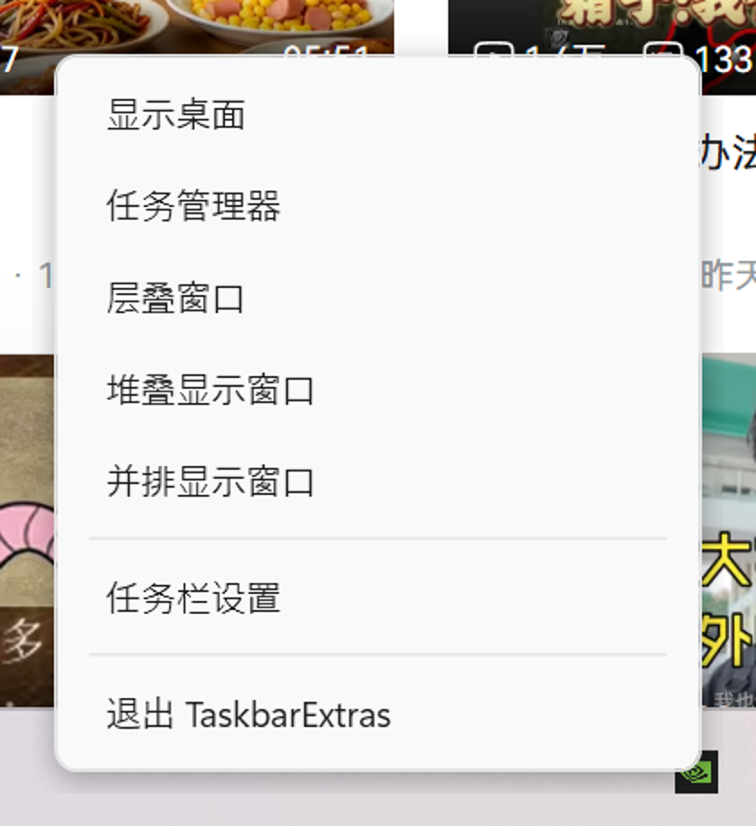
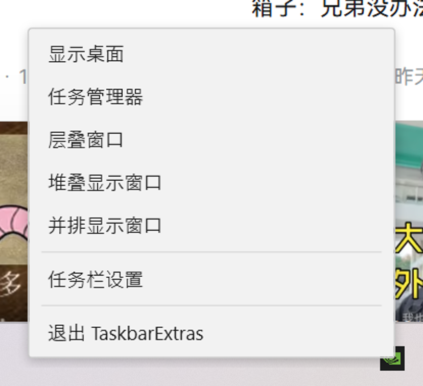

# TaskbarExtras

[English](README.md) · **简体中文**

把 Windows 11 删掉的任务栏右键菜单补回来。



---

## 起因

那天我左手端着快乐水，右手刚离开键盘 —— 想回桌面开个东西。

按 `Win+D` 吧，左手腾不出来。于是我自然而然地右键任务栏，准备点「显示桌面」。

然后我发现这个选项没了。

微软你在干什么啊。😡

行，我自己加回来。 ε=( o｀ω′)ノ

---

## 装了能干嘛

右键任务栏的空白处，弹出的是这些：

| 菜单项 | 干嘛的 |
|---|---|
| 显示桌面 | 最小化所有窗口；再点一次还原 |
| 任务管理器 | 打开任务管理器 |
| 层叠窗口 | 所有窗口层叠排开 |
| 堆叠显示窗口 | 上下平铺 |
| 并排显示窗口 | 左右平铺 |
| 任务栏设置 | 打开系统设置的任务栏页 |
| 退出 TaskbarExtras | 就是退出本程序 |

只有任务栏**空白处**才拦截。右键开始按钮还是 `Win+X`，右键任务图标还是跳转列表，右键托盘图标还是各自的菜单 —— 这些我都没碰。

---

## 跑起来

去 [Releases](../../releases) 下载，或者自己编：

```bash
dotnet publish src/TaskbarExtras.App -c Release -r win-x64 --self-contained true \
  -p:PublishSingleFile=true -p:IncludeNativeLibrariesForSelfExtract=true \
  -p:EnableCompressionInSingleFile=true -o publish
```

出来一个 exe，双击就行。**不需要管理员权限**，也不用预先装 .NET。

```
TaskbarExtras.exe                     启动
TaskbarExtras.exe --quit              让正在运行的实例退出
TaskbarExtras.exe --lang zh|en        强制界面语言（默认跟随系统）
TaskbarExtras.exe --skin win11|win10  菜单外观（默认 win11）
TaskbarExtras.exe --preview           只显示一次菜单，用来预览皮肤
TaskbarExtras.exe --help              显示说明
```

## 怎么退出

没有主窗口，所以没东西可以关。三条路：

1. 右键任务栏 → 菜单最后一项「退出 TaskbarExtras」
2. 右键托盘图标 → 退出（图标在 `^` 折叠区里，是个深色方块加三道横杠）
3. `TaskbarExtras.exe --quit`

---

## 皮肤

菜单长什么样全部写在 `ResourceDictionary` 里，加一套皮肤 = 加一个 xaml 文件，不用改一行 C#。

| win11（默认） | win10 |
|---|---|
|  |  |
| 圆角、宽松、带阴影，跟系统自己的菜单放一起不违和 | 直角、紧凑、扁平，想要老味道就用这个 |

```bash
TaskbarExtras.exe --preview --skin win10    # 先看看再决定
```

---

## 两条设计原则

**一、不注入任何进程。** 不往 `explorer.exe` 里塞 DLL，不打补丁，不改系统文件。它就是个普通进程，开了就在后台待着，关了什么都不留。

**二、只用文档化 API。** 拦截右键用 `WH_MOUSE_LL`（跑在自己进程里），窗口排布用 `IShellDispatch`，拿任务栏位置用 `SHAppBarMessage` 和 `GetMonitorInfo`。没有一处依赖私有结构体偏移或者特征码扫描。

为什么在意这个？因为靠注入实现的同类工具，每次 Windows 功能更新都得跟着改，一旦没跟上就整个坏掉 —— 而「坏掉」的表现往往是任务栏没了、资源管理器起不来，不是少个功能那么温柔。

这不是空话。这套菜单是先在 Python + ctypes 里做了四轮 spike、拿到实测数据之后才落成 C# 的，过程和数字都在 [`docs/DESIGN.md`](docs/DESIGN.md) 里 —— 包括我做错又改回来的那部分。

---

## 已知问题

- **只在单屏 150% 缩放上实测过。** 双屏、混合 DPI 还没试，理论上处理了，但没验证就是没验证。
- **右键到菜单出现有约 40ms 的延迟**。鼠标钩子拦下右键再渲染菜单，这个开销消不掉。
- 没有配置文件。皮肤和语言只能靠命令行参数。
- 没做和其他任务栏工具的兼容处理，一起装可能打架。

## 许可

MIT。
